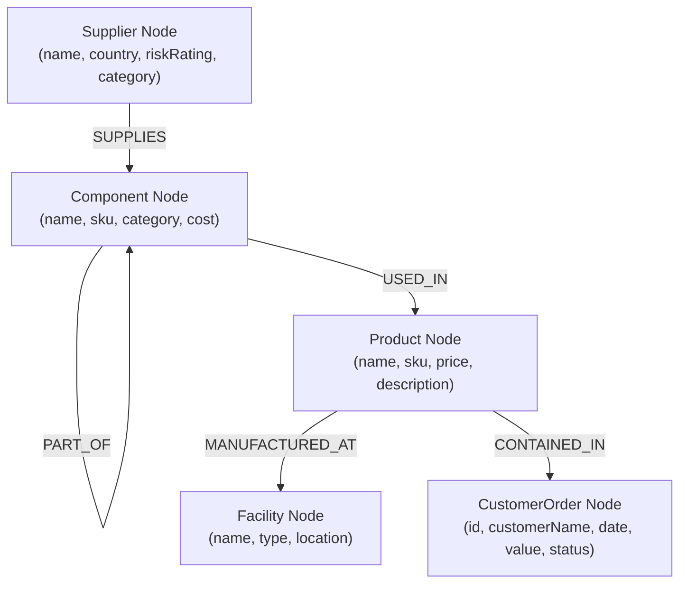
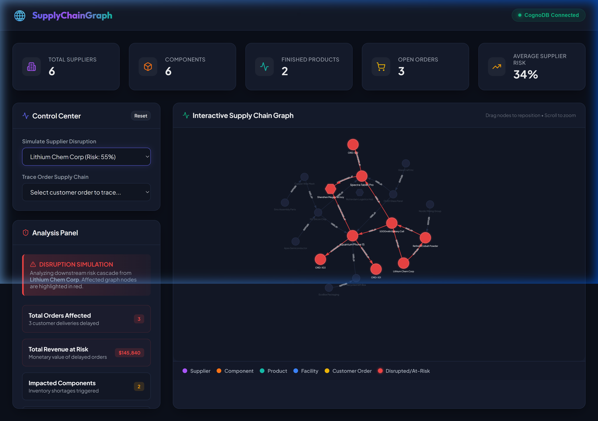

# Supply Chain Risk & Traceability Graph Dashboard

This is a full-stack web application that demonstrates **Supply Chain Disruption Risk Assessment & Product Provenance Traceability**. It is backed by **CognoDB Cloud**, a high-performance managed graph database, using openCypher and the official Neo4j driver.

🌐 **[Live Hosted Application Demo](https://supply-chain-graph-90zk.onrender.com)**

---

## 🌟 Why a Graph Database?

Traditional relational databases represent supply chain elements (suppliers, raw materials, assemblies, finished goods, facilities, and client orders) in separate, disconnected tables. Resolving critical business questions in that schema requires heavy processing:
1. **Variable-Depth Hierarchies**: Components are comprised of other components, which themselves rely on raw minerals from tier-3 suppliers. To query nested component dependency trees in SQL, developers must write complex recursive CTEs that are slow to execute and difficult to maintain. In CognoDB, it is a single, clean path traversal: `(:Component)-[:PART_OF*0..5]->(:Product)`.
2. **Cascading Downstream Risk Analysis**: If a critical raw-materials supplier in Asia experiences a natural disaster, a graph database can immediately trace the impact downstream across multi-hop relationships (`Supplier` ➔ `Component` ➔ `Sub-component` ➔ `Product` ➔ `Order`) in milliseconds, showing exactly which client shipments are at risk and the total revenue affected.
3. **Alternative Sourcing Recommendations**: Graph queries can instantly match an at-risk component with alternative suppliers supplying the exact same SKU, facilitating rapid business mitigation.

---

## 📐 Data Model

Below is the graph structure implemented in our CognoDB database:



---

## 🔍 Key Cypher Queries Explained

All database queries are fully parameterized to prevent Cypher injection.

### 1. Downstream Disruption Simulation (Multi-Hop Cascade)
This query identifies all nodes downstream of a selected supplier. By traversing variable-length paths (`1..5` hops) along supply chain links, it extracts the entire tree of affected inventory, manufacturing lines, and open customer orders.
```cypher
MATCH (s:Supplier {name: $supplierName})
OPTIONAL MATCH path = (s)-[:SUPPLIES|PART_OF|USED_IN|MANUFACTURED_AT|CONTAINED_IN*1..5]->(downstream)
RETURN path, s
```

### 2. Backward Supply Chain Provenance Trace
Given a specific customer order, this query traces back its complete lineage to identify which products it contains, what components/sub-components are required to build them, and which suppliers supply those parts.
```cypher
MATCH path = (o:CustomerOrder {id: $orderId})<-[:CONTAINED_IN]-(p:Product)
OPTIONAL MATCH compPath = (p)<-[:USED_IN]-(c:Component)
OPTIONAL MATCH subPath = (c)<-[:PART_OF*0..3]-(sub:Component)
OPTIONAL MATCH supPath = (sub)<-[:SUPPLIES]-(s:Supplier)
RETURN path, compPath, subPath, supPath
```

### 3. Alternative Mitigating Suppliers Recommendation
If a supplier is disrupted, we search the graph for *other* suppliers who supply the same component, recommending them along with their respective country of origin and risk rating.
```cypher
MATCH (s:Supplier {name: $supplierName})-[:SUPPLIES]->(c:Component)<-[:SUPPLIES]-(alt:Supplier)
WHERE s <> alt
RETURN alt.name AS alternativeSupplier, c.name AS componentName, alt.riskRating AS alternativeRisk, alt.country AS alternativeCountry
```

---

## ⚙️ Tech Stack & Architecture

- **Data Layer**: CognoDB Cloud (accessed via `@neo4j-driver`)
- **Backend API**: Node.js + Express (acts as a secure proxy to CognoDB; keeps database credentials safe in `.env`)
- **Frontend SPA**: React + Vite + Vanilla CSS
- **Interactive Graph Visualizer**: `vis-network` (renders database nodes dynamically, handles canvas zoom, drag-and-drop node placement, and click selection)

---

## 🚀 Setup & Installation

### Prerequisite: Set up CognoDB Cloud
1. Sign up for a free account at [console.cognodb.com](https://console.cognodb.com/signup).
2. Create a free **c0** database instance.
3. Save the **Connection URI** (e.g. `bolt+s://db-c55ce7ee.bravo.databases.cognodb.com`) and the generated **password** for user `cognodb`.

### Step 1: Clone the repository and configure secrets
Create a file named `.env` in the root folder of the project:
```env
COGNODB_URI=bolt+s://your-instance-id.databases.cognodb.com
COGNODB_USER=cognodb
COGNODB_PASSWORD=your-saved-password
PORT=5000
```

### Step 2: Install dependencies
Run the following command at the root of the project:
```bash
npm install
```

### Step 3: Seed the Database
Run the seed script to wipe the database clean and populate it with realistic supply chain nodes and relationships:
```bash
npm run seed
```

### Step 4: Run the Application in Development Mode
Launch the backend server and frontend client concurrently:
```bash
npm run dev
```
Open your browser to [http://localhost:5173](http://localhost:5173) to interact with the dashboard.

---

## 💻 UI Walkthrough

1. **Dashboard KPIs**: Displays total suppliers, components, active assemblies, open orders, and the average risk score across your logistics nodes.
2. **Interactive Graph Canvas**: Drag-and-drop interactive network rendering nodes with dedicated category colors (Purple = Supplier, Orange = Component, Teal = Product, Blue = Facility, Yellow = Customer Order).
3. **Disruption Simulator**: Select any supplier from the dropdown (or click their purple node in the graph). The app will highlight all downstream components, products, and customer orders affected in red on the canvas, showing:
   - Total customer orders delayed.
   - Total monetary revenue at risk.
   - Recommended backup suppliers who supply the same component.
4. **Lineage Tracer**: Select a customer order. The graph dims all unrelated paths and traces the exact supply chain provenance backing that order.
5. **Connection Error State**: Graceful fallbacks and error banners if the CognoDB connection is dropped or misconfigured.

---

## 📸 Screenshots & Demo Walkthrough

Here is the interactive dashboard in action, simulating a supplier failure and highlighting cascading risk across the graph:



Below is a screen recording demonstrating the interactive features (disruption simulation, alternate supplier recommendation, and order provenance trace):

🎥 **[Watch the HD Demo Video on Google Drive](https://drive.google.com/file/d/1Xdeu0_pBwGbe5pZbCX9Ip32jwyUo2W6E/view?usp=sharing)**


